# BRI HR Consultancy Portal - User Flow Diagrams

## 1. Candidate User Flow

## 2. Employer User Flow

## 3. Admin/HR Consultant User Flow

---

## More Diagrams explaining interactions

### 1. **Sequence Diagram** - Role Interactions
Shows how the three roles interact throughout the hiring process:

### 2. **State Diagram** - Job Application States

### 3. **Complete Hiring Process**

```mermaid
flowchart TD
    subgraph Employer["👔 EMPLOYER"]
        E1[Post Job] --> E2[Define Requirements]
        E2 --> E3[Review Shortlist]
        E3 --> E4[Schedule Interviews]
    end
    
    subgraph Admin["👨‍💼 ADMIN/HR CONSULTANT"]
        A1[Receive Job Alert] --> A2[Filter Candidates]
        A2 --> A3[Send Invitations]
        A3 --> A4[Manage Assessments]
        A4 --> A5[Final Shortlist]
    end
    
    subgraph Candidate["👤 CANDIDATE"]
        C1[Receive Invitation] --> C2[Apply to Job]
        C2 --> C3[Complete Assessment]
        C3 --> C4[Wait for Interview]
    end
    
    E2 -.->|Job Details| A1
    A3 -.->|Job Link| C1
    C2 -.->|Application| A3
    C3 -.->|Results| A4
    A5 -.->|Candidates| E3
    E4 -.->|Interview Invite| C4
    
    style Employer fill:#e3f2fd
    style Admin fill:#f3e5f5
    style Candidate fill:#e8f5e9
```

